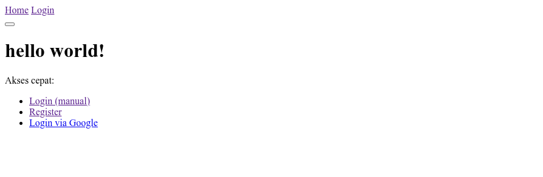

<p align="center">
  <a href="https://laravel.com" target="_blank">
    
  </a>
</p>

<h1 align="center">login-via-google</h1>
<p align="center">Minimal Socialite Integration — Clean, Educational, No Style</p>

<p align="center">
  
  
  
  
</p>

---

A minimal, ready-to-use **Laravel 12** project implementing **Google OAuth2 Login** via Laravel Socialite.  
This repository is built for **learning and reference**, focusing on the **structure and logic flow** of Socialite integration — no UI styling, no frontend frameworks.

---

## 📚 Table of Contents
- [Project Preview](#-project-preview)
- [Features](#-features)
- [Requirements](#-requirements)
- [Clone & Run](#-clone--run)
- [Quick Setup](#-quick-setup)
- [Google OAuth Configuration](#-google-oauth-configuration)
- [Environment Setup (.env)](#-environment-setup-env)
- [Usage Flow](#-usage-flow)
- [Troubleshooting](#-troubleshooting)
- [License](#-license)
- [Best Practices](#-best-practices)

---

## 🔍 Project Preview

This project demonstrates the **core process of Google OAuth login in Laravel**, from redirect to callback handling.  
It’s intentionally left raw — no CSS, no JS — to help developers focus purely on **how Socialite integrates into Laravel’s authentication flow**.

<p align="center">
  
</p>

---

## ✨ Features

- Google Login using official **Laravel Socialite**
- Saves user profile data (name, email, Google ID, avatar)
- Simple and readable Laravel 12 folder structure
- Works both locally and in production
- Designed for learning — no styling or third-party scripts

---

## 🧱 Requirements

- **PHP 8.2+**
- **Laravel 12**
- **Composer**
- **Database** (MySQL, MariaDB, or SQLite)
- **Google Cloud Project** with OAuth consent screen **published**

---

## 🧰 Clone & Run

```bash
# Clone repository
git clone https://github.com/Asyraf2003/login-via-google.git
cd login-via-google

# Install dependencies
composer install

# Copy environment file
cp .env.example .env

# Generate application key
php artisan key:generate

# Migrate database (optional if not using DB)
php artisan migrate

# Run the app
php artisan serve
```

> Default URL: http://127.0.0.1:8000

---

## 🚀 Quick Setup

Before running, make sure you have created your Google OAuth credentials.

---

## 🔧 Google OAuth Configuration

### 1. Create OAuth Credentials

Go to **[Google Cloud Console → APIs & Services → Credentials](https://console.cloud.google.com/apis/credentials)**

- Click **Create Credentials → OAuth 2.0 Client ID**
- Choose **Web Application**
- Add the following **Authorized redirect URIs**:

```
Local:      http://127.0.0.1:8000/auth/google/callback
Valet:      https://your-app.test/auth/google/callback
Production: https://your-domain.com/auth/google/callback
```

Then copy your **Client ID** and **Client Secret**.

---

### 2. Configure Laravel Service

Ensure `config/services.php` includes:

```php
'google' => [
    'client_id'     => env('GOOGLE_CLIENT_ID'),
    'client_secret' => env('GOOGLE_CLIENT_SECRET'),
    'redirect'      => env('GOOGLE_REDIRECT_URI'),
],
```

---

## ⚙️ Environment Setup (.env)

Edit your `.env` file and update these values:

```dotenv
APP_NAME="Laravel Google Login"
APP_ENV=local
APP_URL=http://127.0.0.1:8000

# Database configuration
DB_CONNECTION=mysql
DB_HOST=127.0.0.1
DB_PORT=3306
DB_DATABASE=your_database
DB_USERNAME=your_username
DB_PASSWORD=your_password

# Google OAuth credentials
GOOGLE_CLIENT_ID=your_google_client_id
GOOGLE_CLIENT_SECRET=your_google_client_secret
GOOGLE_REDIRECT_URI=http://127.0.0.1:8000/auth/google/callback
```

Clear cached config afterward:

```bash
php artisan config:clear
php artisan cache:clear
```

---

## 🧪 Usage Flow

1. Start the development server  
   ```bash
   php artisan serve
   ```

2. Open your browser at  
   ```
   http://127.0.0.1:8000
   ```

3. Click the **Login via Google** link (plain HTML link).  
   You’ll be redirected to Google for authorization.  

4. After login approval, you’ll be redirected back to  
   ```
   /auth/google/callback
   ```
   and automatically logged in.  
   User data is stored in your database (name, email, google_id, avatar).

---

## 🧯 Troubleshooting

**redirect_uri_mismatch**  
Ensure the `GOOGLE_REDIRECT_URI` in `.env` exactly matches your registered redirect URI in Google Cloud.  
No trailing slashes, exact protocol and host.

**invalid_client / unauthorized_client**  
Double-check your Client ID and Secret for missing or extra characters.  
Ensure your OAuth consent screen is **Published**.

**State or CSRF mismatch**  
If you’re testing locally without proper sessions, use `->stateless()` in the callback controller.

**User not stored in DB**  
Confirm your migrations include `google_id` and `avatar` fields, and that your `User` model allows mass assignment.

---

## 📄 License

Open-sourced under the [MIT License](https://opensource.org/licenses/MIT).

---

## 💡 Best Practices

- Never commit your real `.env` credentials.
- Use HTTPS and secure cookies in production.
- Document every environment’s redirect URLs (local, staging, prod).
- For extended use, handle token expiration and revocation.
- Great for learning Socialite’s raw structure before adding frontend or UI layers.

---
